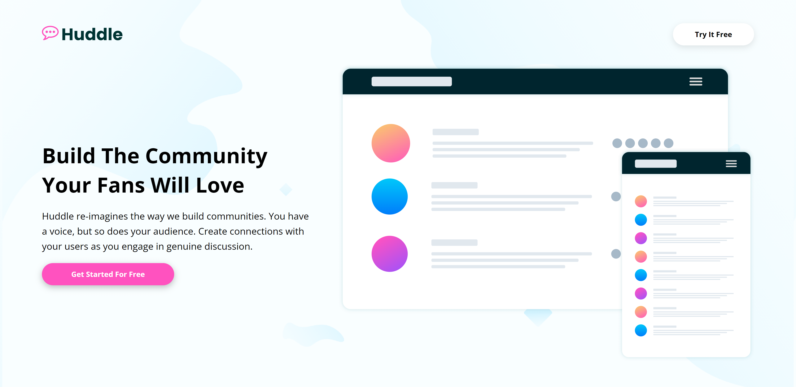
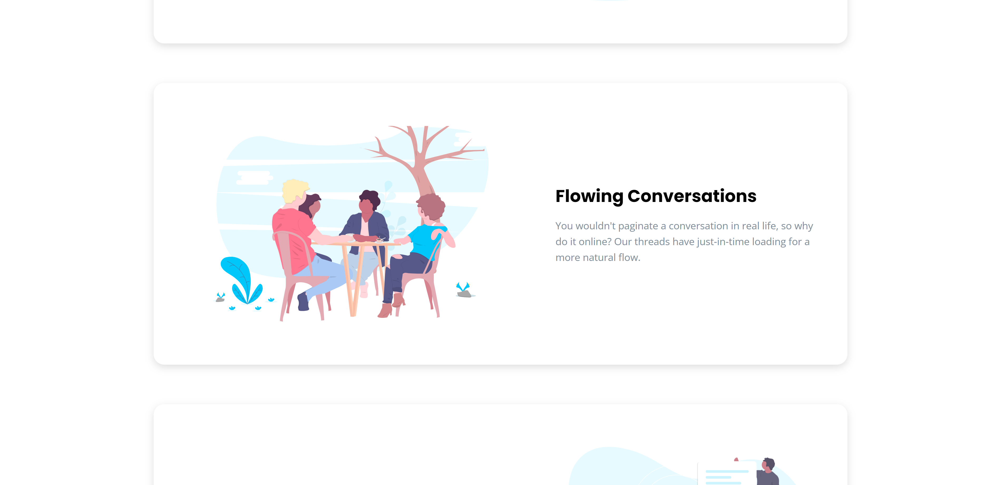
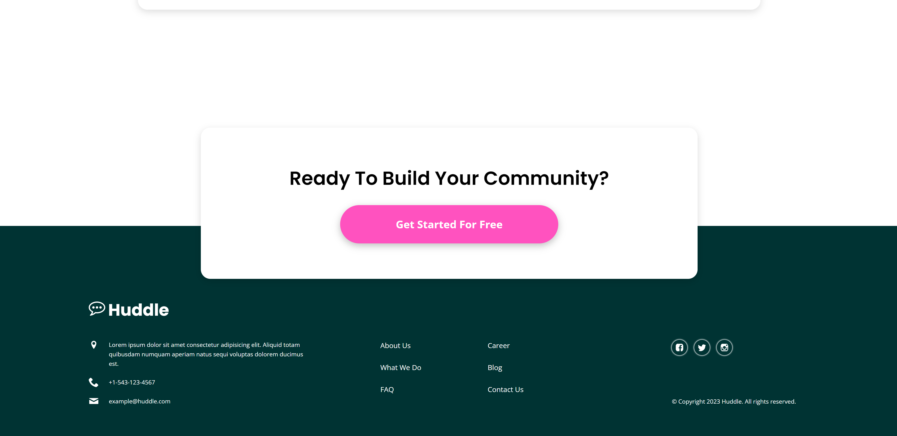
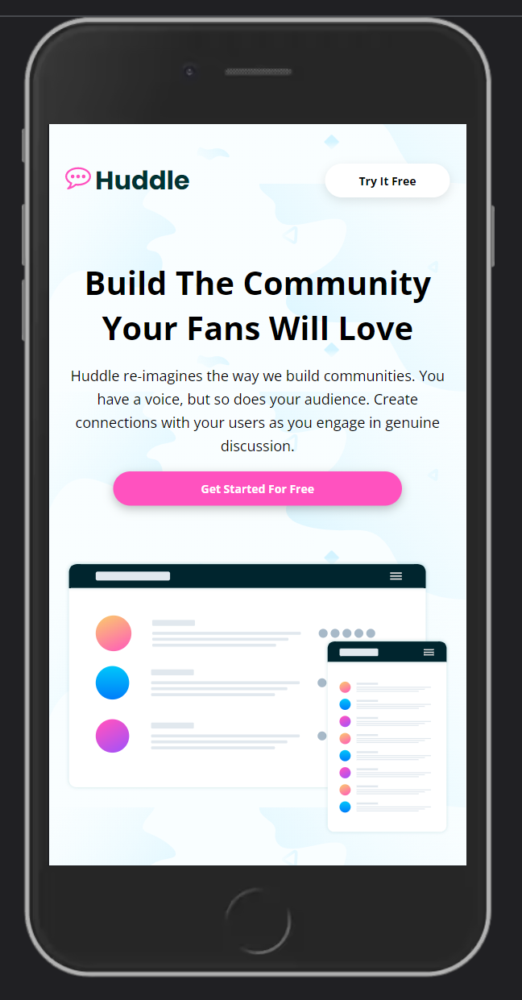

# Huddle

A mobile responsive landing page for a fictional messaging company called 'Huddle'.

## Link

See it here: https://huddle-nickm.netlify.app/

## Screenshots

 

 

 

 

## Description

This is a simple landing page from Frontend Mentor I built entirely using React, Styled Components, and the React Intersection Observer API. You can view more information about this challenge [here](https://www.frontendmentor.io/challenges/huddle-landing-page-with-alternating-feature-blocks-5ca5f5981e82137ec91a5100) My goal was to practice using Styled Components along with CSS Grid to create a nice-looking static landing page with React.

## Features

The landing page functions mostly like other landing pages; however, I added a few fade-in scroll animations using the React Intersection Observer API to better simulate a modern website and to learn how to use the IO API with React. It features a heading, an alternating feature block section, a CTA section, and a footer.

## Technology

I found Styled Components quite interesting in that the styled components themselves can live within the React components or they can be placed in a separate directory of their own. I did a little of both to get the hang of both approaches. As a result, there are a few areas where component organization could be a bit more consistent, but this was all for the sake of practice.

React
 
Vite
 
Styled Components
 
React-intersection-observer
 
Mobile responsiveness
 

## Questions:

Feel free to contact me at mully7773@gmail.com if you have any questions.  
You can view more of my projects at https://github.com/Mully7773.
